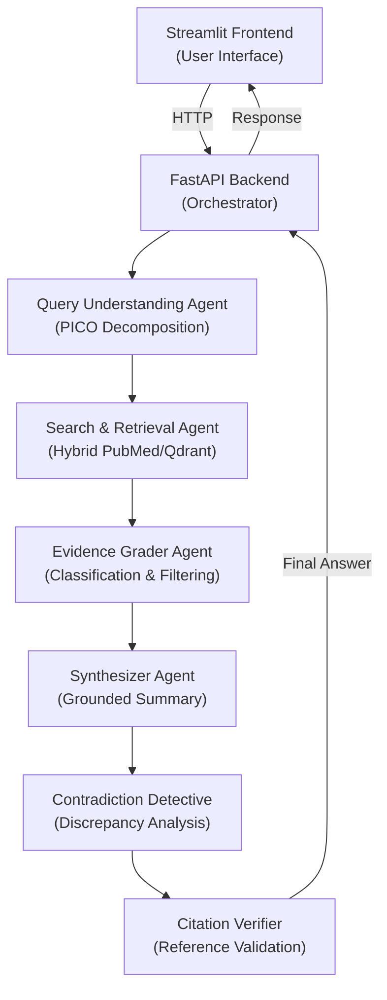

#  Lyra Research: Agentic Healthcare Copilot

Lyra Research is an advanced, multi-agent AI research assistant designed for clinicians and medical researchers. It decomposes complex clinical questions using the **PICO framework**, retrieves high-quality evidence from **PubMed**, and synthesizes a grounded answer with **verifiable inline citations**.

---

##  System Architecture

The system uses a sequential pipeline of **6 specialized agents** coordinated by CrewAI.



### 🧬 The 6-Agent Pipeline
1.  **Query Understanding**: Decomposes natural language into Patient, Intervention, Comparison, and Outcome (PICO).
2.  **Search/Retrieval**: Performs hybrid search across local vector storage (Qdrant) and live PubMed E-utilities.
3.  **Evidence Grader**: Classifies study designs (RCT, Meta-analysis, etc.) and filters for quality.
4.  **Contradiction Detective**: Flags discrepancies between multiple sources.
5.  **Synthesizer**: Composes a balanced clinical summary with `[#]` citations.
6.  **Citation Verifier**: Cross-checks every claim against the verbatim source text.

---

##  Quick Start (Local Development)

### Prerequisites
- **Python 3.12+**
- **Ollama** (running `gemma3:12b` or similar)
- **Docker & Docker Compose** (optional)

### 1. Setup Environment
```bash
cp .env.template .env
# Add your PUBMED_EMAIL (required for E-utilities)
```

### 2. Run with Docker (Recommended)
```bash
docker-compose up --build
```
- UI: `http://localhost:8501`
- API: `http://localhost:8000`

### 3. Run Manually
```bash
# Start backend and frontend concurrently
chmod +x run_dev.sh
./run_dev.sh
```

---

##  Key Features
- **Facet Filtering**: Filter research by year range and study type (Guideline, RCT, Meta-analysis).
- **Verifiable Quotes**: Every claim connects to a source quote and direct PubMed link.
- **Evidence Synthesis Table**: Structured PICO-ready table for comparing articles.
- **"What Changed" Panel**: Highlights high-impact evidence from the last 24 months.

---

##  Compliance & Disclaimers
- **Research & Education Only**: This tool is not intended for clinical decision-making. No patient data should be entered into the system.
- **PubMed Usage**: Adheres to NCBI E-utilities usage policies.
- **Local LLM**: Data remains private and local when using Ollama.

---

##  Sample Traces
Agent reasoning traces are stored in `data/sample_traces/` in JSONL format for transparency and auditing.
